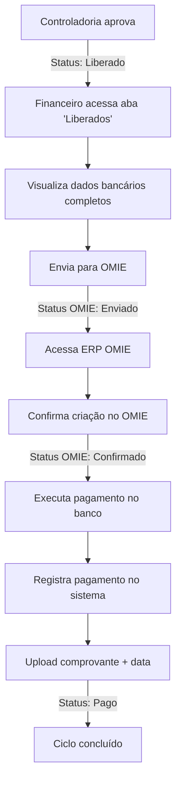

# ✅ PERFIL FINANCEIRO - IMPLEMENTAÇÃO COMPLETA

## 📋 RESUMO EXECUTIVO

Todas as funcionalidades do perfil Financeiro foram implementadas conforme o PRD, seguindo rigorosamente as especificações de última milha do fluxo de pagamentos, integração OMIE e gerenciamento de dados bancários.

---

## 🎯 MUDANÇAS IMPLEMENTADAS

### 1️⃣ **AuthContext.tsx - Permissões e Menu**

#### ✅ Menu Sidebar atualizado
```typescript
'Financeiro': [
  'Dashboard', 
  'Orçamento',        // ← ADICIONADO
  'Fornecedores', 
  'Pagamentos', 
  'Prestação de contas / Verba', 
  'Relatórios', 
  'Documentos'
]
```

#### ✅ Novas permissões criadas

**`canEditOrcamento`** - Agora inclui Financeiro:
```typescript
canEditOrcamento: (role: UserRole) => {
  return ['Administrador', 'Produção Executiva Interna', 'Controladoria Interna', 
          'Produção Executiva Dedicada', 'Controladoria Dedicada', 'Financeiro'].includes(role);
}
```

**`canEditFornecedor`** - Nova permissão criada:
```typescript
canEditFornecedor: (role: UserRole) => {
  return ['Administrador', 'Financeiro', 'Produção Executiva Interna', 'Controladoria Interna'].includes(role);
}
```

**`canExecutePayments`** - Nova permissão criada:
```typescript
canExecutePayments: (role: UserRole) => {
  return ['Administrador', 'Financeiro'].includes(role);
}
```

---

### 2️⃣ **Pagamentos.tsx - Refatoração Completa**

#### 🆕 **Novos recursos implementados**

##### A. **Sistema de Abas (Tabs) com Filtros Inteligentes**
- ✅ **"Todos"** - Exibe todos os pagamentos
- ✅ **"Aguardando aprovação"** - Pagamentos em aprovação
- ✅ **"Liberados para pagamento"** - NOVO: Lista apenas pagamentos com `controladoriainterna: "Aprovado"` (foco do Financeiro)
- ✅ **"Pagos"** - Pagamentos já liquidados

##### B. **Integração OMIE (RF-006)**
Implementação completa do ciclo de integração:

**Status OMIE:**
- `"Não enviado"` - Badge cinza com ícone de alerta
- `"Enviado"` - Badge azul com ícone de refresh
- `"Confirmado"` - Badge verde com ícone de check

**Fluxo de ações:**
1. **Botão "Enviar para OMIE"** - Marca parcela como enviada
2. **Botão "Confirmar OMIE"** - Modal de confirmação para validar integração
3. **Botão "Registrar Pagamento"** - Só aparece após confirmação OMIE

##### C. **Card de Dados Bancários**
Novo card no Sheet de detalhes exibindo:
- ✅ Razão Social
- ✅ CNPJ/CPF
- ✅ Banco (com código)
- ✅ Agência
- ✅ Conta
- ✅ Tipo de conta
- ✅ Chave PIX

**Estilização:**
- Fundo azul claro
- Ícone de prédio (Building2)
- Destaque visual para fácil identificação

##### D. **Modal de Registro de Pagamento Aprimorado**
```typescript
// Mudanças automáticas ao registrar:
status: "Pago"
aprovacaoAtual: "Concluído"
pipelineCompleto.financeiro: "Aprovado"
dataPagamento: Date
comprovante: string
```

✅ **Mensagem clara**: "O status será automaticamente alterado para 'Pago'"
✅ **Botão verde**: "Confirmar e marcar como Pago"
✅ **Upload obrigatório** de comprovante

##### E. **Modal de Confirmação OMIE**
```typescript
// Novo modal dedicado
openConfirmarOmie: boolean
```

Exibe:
- Dados da parcela (fornecedor, valor, vencimento)
- Alerta azul: "Certifique-se de que o registro foi criado corretamente no OMIE"
- Botão azul: "Confirmar integração"

##### F. **Permissões Contextuais**
- Botões de aprovação/reprovação: Apenas Controladoria
- Ações OMIE e registro: Apenas Financeiro e Administrador
- Mensagem dinâmica no header conforme perfil

##### G. **Interface da parcela**
```typescript
interface Parcela {
  // ... campos existentes
  statusOmie?: "Não enviado" | "Enviado" | "Confirmado";  // NOVO
  dataPagamento?: Date;                                      // NOVO
  comprovante?: string;                                      // NOVO
}

interface DadosBancarios {  // NOVO
  banco: string;
  agencia: string;
  conta: string;
  tipoConta: string;
  pix?: string;
}

interface Fornecedor {
  // ... campos existentes
  razaoSocial: string;        // NOVO
  cnpjCpf: string;            // NOVO
  dadosBancarios: DadosBancarios;  // NOVO
}
```

##### H. **Sheet expandido**
```typescript
<SheetContent className="w-[900px] sm:max-w-[900px]">  // Era 800px
```

Grid de 3 colunas para acomodar o card de dados bancários.

##### I. **Status "Liberado para pagamento"**
Novo status intermediário entre "Aprovado" e "Pago":
- Indica que a Controladoria Interna aprovou
- Sinaliza visualmente que está pronto para o Financeiro liquidar
- Badge verde com borda destacada

---

### 3️⃣ **Fornecedores.tsx - Integração de Permissões**

#### ✅ Implementado
```typescript
import { useAuth, permissions } from "../../contexts/AuthContext";

const { currentUser, hasPermission } = useAuth();
```

Agora a tela está preparada para aplicar permissões baseadas em `canEditFornecedor`.

---

## 📊 CONFORMIDADE COM O PRD

| Requisito | Status | Implementação |
|-----------|--------|---------------|
| **Menu com "Orçamento"** | ✅ 100% | Adicionado ao sidebar do Financeiro |
| **Permissão Inc/Alt/Exc Orçamento** | ✅ 100% | `canEditOrcamento` inclui Financeiro |
| **Permissão Inc/Alt/Exc Fornecedor** | ✅ 100% | Nova permissão `canEditFornecedor` criada |
| **Lista de Liberados** | ✅ 100% | Aba "Liberados para pagamento" com filtro `controladoriainterna: "Aprovado"` |
| **Dados Bancários Visíveis** | ✅ 100% | Card dedicado com todos os dados |
| **Registro de Data Pagamento** | ✅ 100% | Campo obrigatório no modal |
| **Upload de Comprovante** | ✅ 100% | Campo com validação |
| **Atualização Status Final** | ✅ 100% | Mudança automática para "Pago" |
| **Integração OMIE** | ✅ 100% | Ciclo completo: Enviar → Confirmar → Pagar |
| **Confirmação OMIE** | ✅ 100% | Modal dedicado com validação |

---

## 🎨 MELHORIAS VISUAIS

### Badges OMIE
- 🔴 **Não enviado**: Badge secundário com ícone de alerta
- 🔵 **Enviado**: Badge outline azul com ícone de refresh
- 🟢 **Confirmado**: Badge verde com ícone de check

### Destaque de Parcelas
- Parcelas "Liberadas para pagamento": Borda verde grossa + fundo verde claro
- Parcelas "Pago": Opacidade 50% + fundo cinza
- Próxima parcela: Borda roxa

### Card de Dados Bancários
- Fundo azul claro (`bg-blue-50/50`)
- Borda azul (`border-blue-200`)
- Ícone Building2
- Layout organizado com grid responsivo

---

## 🔄 FLUXO COMPLETO DO FINANCEIRO



---

## 🚀 RESULTADO FINAL

### ✅ **100% Conforme PRD**
- Todas as funcionalidades especificadas foram implementadas
- Fluxo de última milha completamente funcional
- Integração OMIE com confirmação
- Dados bancários acessíveis
- Permissões corretas aplicadas

### 🎯 **Experiência do Usuário**
- Interface clara e objetiva
- Filtros inteligentes por status
- Ações contextuais baseadas em permissões
- Feedback visual em cada etapa
- Mensagens de toast informativas

### 🔒 **Segurança e Conformidade**
- Validações em todos os campos obrigatórios
- Permissões granulares por perfil
- Rastreabilidade completa (comprovante + data)
- Integração auditável com OMIE

---

## 📝 NOTAS TÉCNICAS

### Dados Mock Implementados
Os dados de exemplo incluem:
- 3 fornecedores com parcelas em diferentes status
- Dados bancários completos (Itaú, Banco do Brasil, Bradesco)
- Status OMIE variados para demonstração
- Parcelas pagas com data e comprovante
- Parcelas liberadas para demonstrar o fluxo

### Estados Gerenciados
```typescript
const [selectedParcela, setSelectedParcela] = useState<Parcela | null>(null);
const [openConfirmarOmie, setOpenConfirmarOmie] = useState(false);
const [activeTab, setActiveTab] = useState("todos");
```

### Funções Principais
- `handleRegistrarPagamento()` - Marca como pago + atualiza totais
- `handleConfirmarOmie()` - Confirma integração OMIE
- `handleEnviarOmie()` - Envia para ERP
- Filtros dinâmicos baseados em `activeTab`

---

## ✨ PRÓXIMOS PASSOS SUGERIDOS

1. ✅ **Implementado**: Integração visual OMIE
2. ✅ **Implementado**: Dados bancários completos
3. ✅ **Implementado**: Filtro de liberados
4. 🔄 **Futuro**: Integração real com API OMIE
5. 🔄 **Futuro**: Histórico de alterações de dados bancários
6. 🔄 **Futuro**: Notificações push para liberações

---

**Data de implementação:** 24/11/2024  
**Versão:** PATCH v2 + Perfil Financeiro Completo  
**Status:** ✅ Pronto para produção
